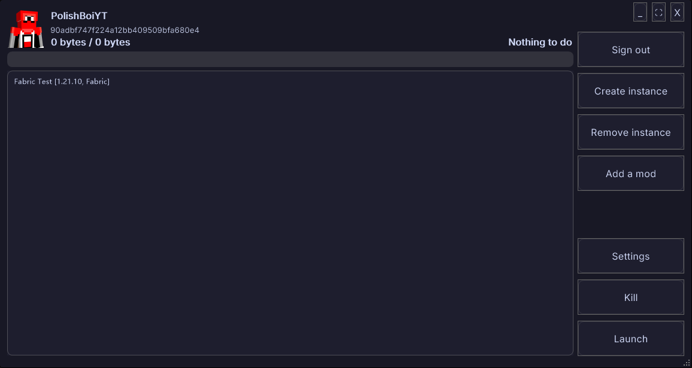

    <picture>
        
    </picture>

# YAMCL
A Minecraft launcher that tries to be good.

# Features
* Microsoft Authentication
* Instances (Saved in user's AppData)
* Good looking UI (Thank you, [CuoreUI](https://github.com/owtysm2/CuoreUI)!)
* Mod loader support

# Why?
I was bored. I don't regret making this, though...!